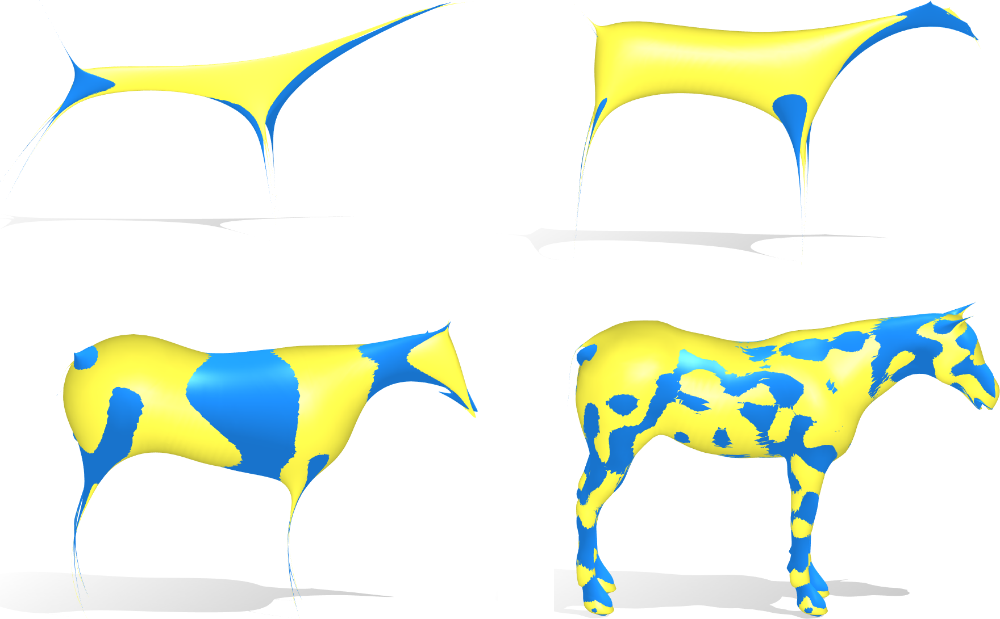
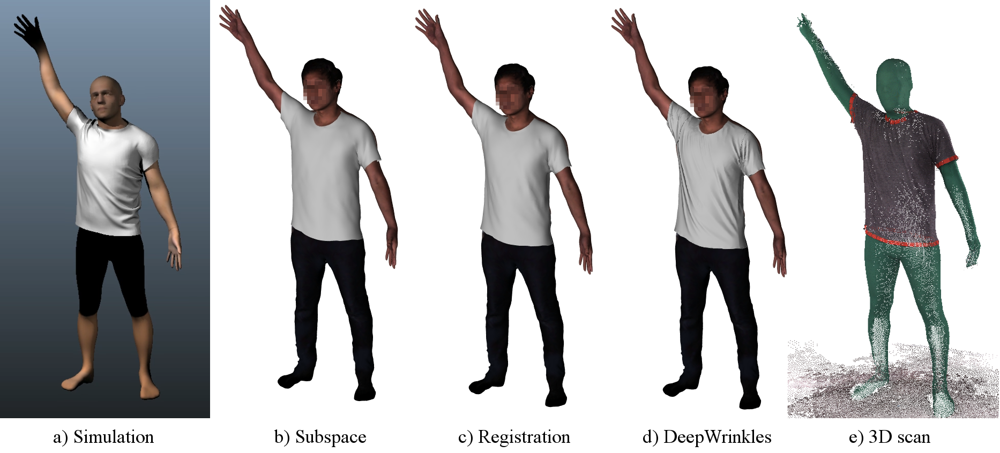
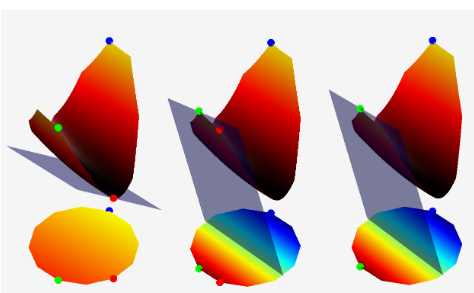
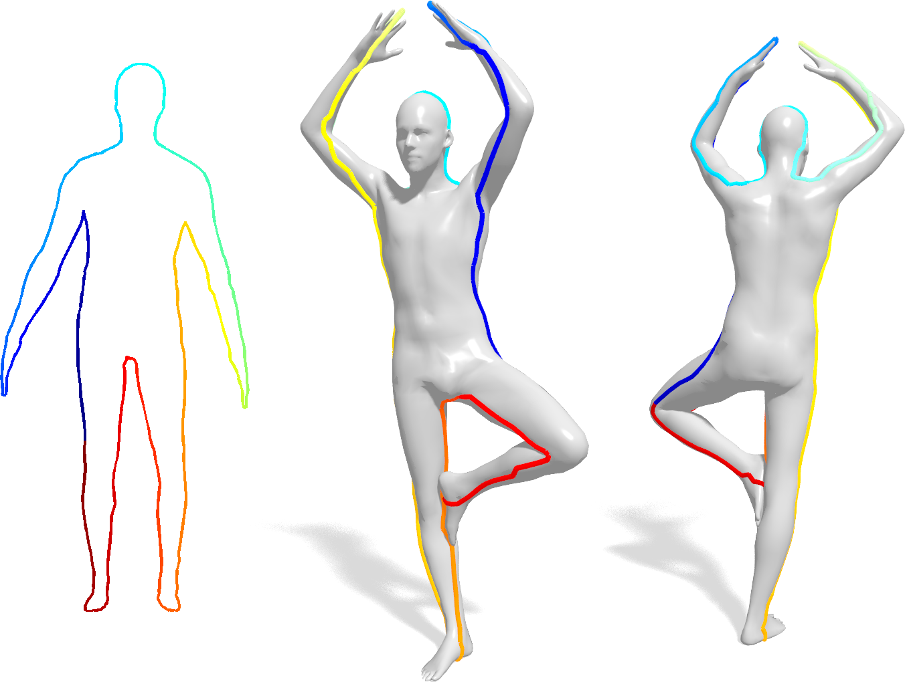
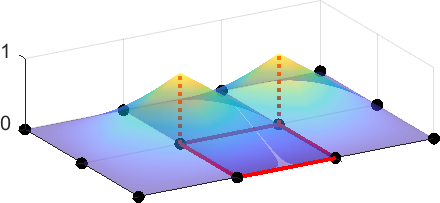

## Conference Papers

|  | **Isometric Multi-Shape Matching** (Maolin Gao, *Zorah Lähner*, Johan Thunberg, Daniel Cremers, Florian Bernard) In IEEE Conference on Computer Vision and Pattern Recognition (CVPR), 2021. [(arxiv)](https://arxiv.org/abs/2012.02689) |
|  | **Simulated Annealing for 3D Shape Correspondence** (Benjamin Holzschuh, *Zorah Lähner*, Daniel Cremers) In International Conference on 3D Vision (3DV), 2020. |
|  | **Unsupervised Dense Shape Correspondence using Heat Kernels** (Mehmet Aygün, *Zorah Lähner*, Daniel Cremers) In International Conference on 3D Vision (3DV), 2020. |
|  | **Smooth Shells: Multi-Scale Shape Registration with Functional Maps** (Marvin Eisenberger, *Zorah Lähner*, Daniel Cremers) In IEEE Conference on Computer Vision and Pattern Recognition (CVPR), 2020. [(bibtex)](../assets/bibtex/eisenberger2020smoothshells.txt) [(arxiv)](https://arxiv.org/abs/1905.12512) |
|  | **DeepWrinkes: Accurate and Realistic Clothing Modeling** (*Zorah Lähner*, Daniel Cremers, Tony Tung) In European Conference on Computer Vision (ECCV), 2018. [(bibtex)](../assets/bibtex/laehner2018deepwrinkles.txt) [(pdf)](../assets/pdfs/laehner2018deepwrinkles.pdf) [(video)](https://www.youtube.com/watch?v=g2hmNE1AxjQ&list=PLqHzsfkXuhrvsjPdysCD72D9iFLH-VFgT&index=4) [(homepage)](https://research.fb.com/publications/deepwrinkles-accurate-and-realistic-clothing-modeling/) |
|  | **Efficient Deformable Shape Correspondence via Kernel Matching** (Matthias Vestner, *Zorah Lähner*, Amit Boyarski, Or Litany, Ron Slossberg, Tal Remez, Emanuele Rodolà, Alex M. Bronstein, Michael M. Bronstein, Ron Kimmel, Daniel Cremers) In International Conference on 3D Vision (3DV), 2017. [(bibtex)](../assets/bibtex/vestner2017kernelmatching.txt) [(pdf)](../assets/pdfs/kernel17.pdf) |
|  | **Efficient Globally Optimal 2D-to-3D Deformable Shape Matching** (*Zorah Lähner*, Emanuele Rodolà, Frank R. Schmidt, Michael M. Bronstein, Daniel Cremers) In IEEE Conference on Computer Vision and Pattern Recognition (CVPR), 2016. [(bibtex)](../assets/bibtex/laehner2016elastic2D3D.txt) [(pdf)](../assets/pdfs/lrsbc16.pdf) |

## Journal Articles

|  | **Divergence-Free Shape Correspondence by Deformation** (Marvin Eisenberger, *Zorah Lähner*, Daniel Cremers) Computer Graphics Forum, 2019. [(pdf)](../assets/pdfs/eisenberger2019divfree.pdf) |
|  | **Functional Map Representation on Product Manifolds** (Emanuele Rodolà, *Zorah Lähner*, Alex M. Bronstein, Michael M. Bronstein, Justin Solomon) In Computer Graphics Forum, Volume 38, Issue 1, 2019. [(bibtex)](../assets/bibtex/rodola2018funmaprep.txt) [(pdf)](../assets/pdfs/rodola2018funmaprep.pdf) |

## Workshop Papers

|  | **SHREC'16: Matching of Deformable Shapes with Topological Noise** (*Zorah Lähner*, Emanuele Rodolà, Michael M. Bronstein, Daniel Cremers, Oliver Burghard, Luca Cosmo, Alex Dieckmann, Rolf Klein, Yusuf Sahillioğlu) In Eurographics Workshop on 3D Object Retrieval (3DOR), 2016. [(bibtex)](../assets/bibtex/laehner2016shrec.txt) [(pdf)](../assets/pdfs/shrec16-3dor.pdf) |
