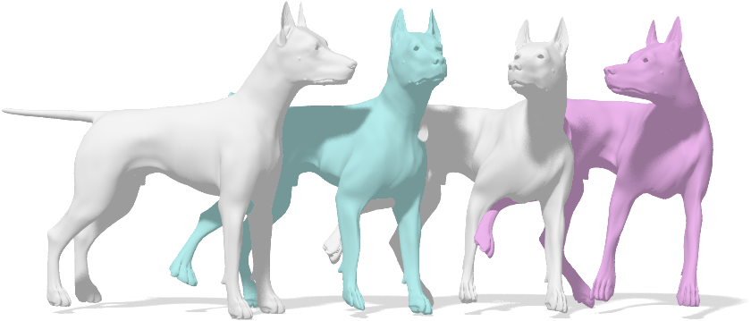

{{ page.authors }}

## Abstract

> We propose the first algorithm for non-rigid 2D-to-3D shape matching, where the input is a 2D query shape as well as a 3D target shape and the output is a continuous matching curve represented as a closed contour on the 3D shape. We cast the problem as finding the shortest circular path on the product 3-manifold of the two shapes. We prove that the optimal matching can be computed in polynomial time with a (worst-case) complexity of O(mn^2 log(n)), where m and n denote the number of vertices on the 2D and the 3D shape respectively. Quantitative evaluation confirms that the method provides excellent results for sketch-based deformable 3D shape retrieval.

## Resources

<a href=" {{ page.paperurl }} ">[pdf]</a> <a href=" {{ page.arxiv }} ">[arxiv]</a> <a href=" {{ page.code }} ">[github]</a> <a href=" {{ page.video }} ">[video]</a> <a href=" {{ page.poster }} ">[video]</a>

## Bibtex

    @InProceedings{eisenberger2019divfree,
        author       = {Marvin Eisenberger and Zorah L\"ahner and Daniel Cremers},
        title        = {Divergence-Free Shape Correspondence by Deformation},
        booktitle    = {Symposium on Geometry Processing {(SGP)}},
        year         = {2019},
    }
