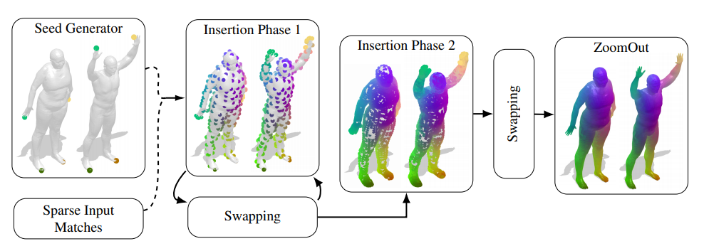

{{ page.authors }}

## Abstract

> We propose to use Simulated Annealing to solve the correspondence problem between near-isometric 3D shapes. Our method gains efficiency through quickly upsampling a sparse correspondence by minimizing the embedding error of new samples on the surfaces and applying simulated annealing to refine the result. The algorithm alternates between sampling additional points on the surface and swapping points within the current solution according to Simulated Annealing theory. Simulated Annealing is a probabilistic method and less prone to get stuck in local extrema which allows us to obtain good results on the NP-hard quadratic assignment problem (QAP). Our method can be used as a stand-alone correspondence pipeline through an initial seed generator as well as to densify a set of sparse input matches. Furthermore, the use of locality sensitive hashing to approximate geodesic distances reduces the computational complexity and memory consumption significantly. This allows our algorithm to run on meshes with over 100k points, an accomplishment that few approaches tackling the QAP directly achieve. We show convincing results on datasets like TOSCA and SHREC’19 Connecitvity.

## Resources

<a href=" {{ page.paperurl }} ">[pdf]</a> <a href=" {{ page.arxiv }} ">[arxiv]</a> <a href=" {{ page.code }} ">[github]</a> <a href=" {{ page.video }} ">[video]</a> <a href=" {{ page.poster }} ">[video]</a>

## Bibtex

    @InProceedings{holzschuh2020simanneal,
        author 	= {Benjamin Holzschuh and Zorah L\"ahner and Daniel Cremers},
        title 	= {Simulated Annealing for 3D Shape Correspondence},
        booktitle = {Conference on 3D Vision (3DV)},
        year 		= {2020},
    }
