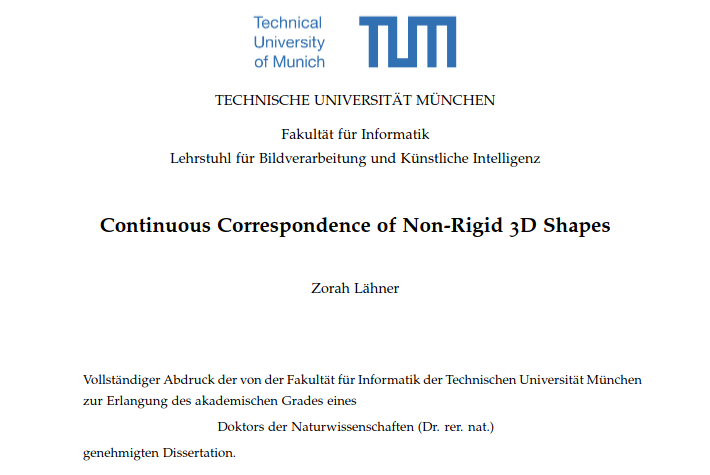

{{ page.authors }}

## Abstract

> The non-rigid 3D shape correspondence problem is an important part of many algorithms
for geometry processing, and applications in virtual and augmented reality. However,
non-rigidity increases the degrees of freedom in comparison to the rigid problem and leads to
algorithms that need to compromise between runtime, and guaranteeing desirable properties,
like continuity, in the solution. In this thesis, we explore several efficient algorithms solving
for continuous correspondences between non-rigid shapes. The first considers taking a 2D
contour and a 3D shape as input. Trans-dimensional settings are especially hard, because
common descriptors are not comparable between different dimensions and a lot of methods
rely on projecting the higher dimensional shape down instead. This does not work for non-rigid
deformations on the 3D shapes, but we show that popular spectral descriptors for non-rigid
cases can be transferred to the 2D-3D setting with minimal adjustment. Using the special
1-dimensional structure of the solution for contour shapes, we pose the correspondence as
a shortest path problem on the product graph. This can be solved efficiently by Dijkstra’s
algorithm and a branch-and-bound strategy. In the case of two 3D input shapes the solution is
2-dimensional, so it is a minimal surface instead of a shortest path. This can be formulated as a
quadratic assignment problem (QAP) between kernels, and we show that using positive-definite
heat kernels has superior theoretical properties to previously used gaussian kernels. We solve
the QAP through difference of convex functions programming in a series of linear assignment
problems. Additionally, we introduce a multi-scale approach which separates the problem
into solvable subsets but can still propagate global information throughout. Furthermore, we
analyze the properties of maps on the product manifold to prove that conventional algorithms
do not make use of the optimal representation in the separable Laplace-Beltrami eigenbasis.
Based on this observation we show what the optimal representation is and proprose a novel, not
separable, localized basis that is better suited for correspondences, and we propose a framework
to refine correspondences directly on the product manifold. Finally, we introduce a method
that produces continuous correspondences based on a smooth, volume-preserving deformation
field. We argue that for most real-world objects not only is the correspondence smooth, but
there also exists a sequence of intermediate shapes with the same properties transforming
the source into the target. To this end, our algorithm solves for the correspondences and
the deformation jointly using an expectation-maximization approach. Because we represent
the deformation in a closed-form, frequency ordered basis, we can perform the optimization
efficiently on a subsampling but still retrieve a solution and interpolation for shapes of any
resolution with only linear overhead, and without discretization artifacts.

## Resources

<a href=" {{ page.paperurl }} ">[pdf]</a> <a href=" {{ page.arxiv }} ">[arxiv]</a> <a href=" {{ page.code }} ">[github]</a> <a href=" {{ page.video }} ">[video]</a> <a href=" {{ page.poster }} ">[video]</a>

## Bibtex

    @phdthesis{laehner2021diss,
        author 	= {Zorah L\"ahner},
        title 	= {Continuous Correspondence of Non-Rigid 3D Shapes},
        school  = {Technical University of Munich {(TUM)}},
        year 		= {2021},
    }
