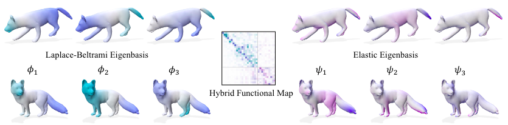

{{ page.authors }}

## Abstract

> With the wide adaption of deep learning and pre-trained models rises the question of how to effectively reuse existing latent spaces for new applications. One important question is how the geometry of the latent space changes in-between different training runs of the same architecture and different architectures trained for the same task. Previous works proposed that the latent spaces for similar tasks are approximately isometric. However, in this work we show that method restricted to this assumption perform worse than when just using a linear transformation to align the latent spaces. We propose directly computing a transformation between the latent codes of different architectures which is more efficient than previous approaches and flexible wrt. to the type of transformation used. Our experiments show that aligning the latent space with a linear transformation performs best while not needing more prior knowledge.

## Resources

<a href=" {{ page.paperurl }} ">[pdf]</a> <a href=" {{ page.arxiv }} ">[arxiv]</a> <a href=" {{ page.code }} ">[github]</a> <a href=" {{ page.video }} ">[video]</a> <a href=" {{ page.poster }} ">[video]</a>

## Bibtex

    @inproceedings{bastian2023hybrid,
        author 	= {Lennart Bastian and Yizheng Xie and Nassir Navab and Zorah Lähner},
        title 	= { Hybrid Functional Maps for Crease-Aware Non-Isometric Shape Matching },
        booktitle = {arxiv:2312.03678},
        year 	= 2023,
    }
