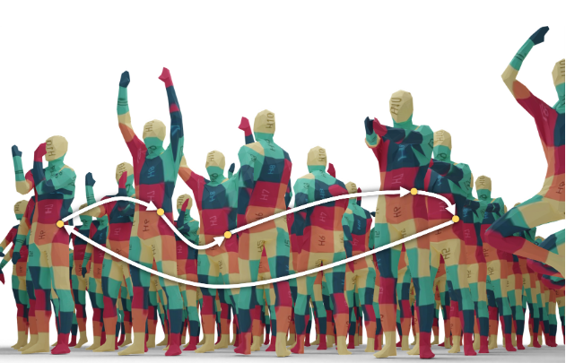

{{ page.authors }}

## Abstract

> Jointly matching multiple, non-rigidly deformed 3D shapes is a challenging, NP-hard problem. A perfect matching is necessarily cycle-consistent: Following the pairwise point correspondences along several shapes must end up at the starting vertex of the original shape. Unfortunately, existing quantum shape-matching methods do not support multiple shapes and even less cycle consistency. This paper addresses the open challenges and introduces the first quantum-hybrid approach for 3D shape multi-matching; in addition, it is also cycle-consistent. Its iterative formulation is admissible to modern adiabatic quantum hardware and scales linearly with the total number of input shapes. Both these characteristics are achieved by reducing the N -shape case to a sequence of three-shape matchings, the derivation of which is our main technical contribution. Thanks to quantum annealing, high-quality solutions with low energy are retrieved for the intermediate NP-hard objectives. On benchmark datasets, the proposed approach significantly outperforms extensions to multi-shape matching of a previous quantum-hybrid two-shape matching method and is on-par with classical multi-matching methods. 

## Resources

<a href=" {{ page.paperurl }} ">[pdf]</a> <a href=" {{ page.arxiv }} ">[arxiv]</a> <a href=" {{ page.code }} ">[github]</a> <a href=" {{ page.video }} ">[video]</a> <a href=" {{ page.poster }} ">[video]</a>

The official project homepage can be found [here](https://4dqv.mpi-inf.mpg.de/CCuantuMM/).

## Bibtex

    @inproceedings{bhatia2023ccuantumm,
        author 	= {Harshil Bhatia and Edith Tretschk and Zorah L\"ahner and Marcel {Seelbach Benkner} and Michael Moeller and Christian Theobalt and Vladislav Golyanik},
        title 	= { CCuantuMM: Cycle-Consistent Quantum-Hybrid Matching of Multiple Shapes },
        booktitle = {IEEE Conference on Computer Vision and Pattern Recognition (CVPR)},
        year 	= 2023,
    }
