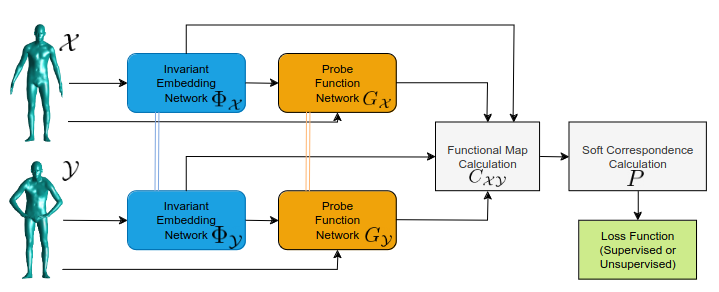

{{ page.authors }}

## Abstract

> Calculating correspondences between non-rigidly deformed shapes is the backbone of many applications in 3D computer vision and graphics.
The functional map approach offers an efficient solution to this problem and has been very popular in learning frameworks due to its low-dimensional and continuous nature. However, most methods rely on the eigenfunctions of the Laplace-Beltrami operator as a basis for the underlying function spaces. While these have many advantages, they are also sensitive to non-isometric deformations and noise. Recently a method to learn the basis functions along with suitable descriptors has been proposed by Marin et al. We do an in-depth analysis of the architecture proposed, including a new training scheme to increase robustness against sampling inconsistencies and an extension to unsupervised training which still obtains results on-par with the supervised approach.

## Resources

<a href=" {{ page.paperurl }} ">[pdf]</a> <a href=" {{ page.arxiv }} ">[arxiv]</a> <a href=" {{ page.code }} ">[github]</a> <a href=" {{ page.video }} ">[video]</a> <a href=" {{ page.poster }} ">[video]</a>

## Bibtex

    @inproceedings{gao2023sigma,
        author 	= { Sharik Siddiqi and Zorah L\"ahner },
        title 	= { A Network Analysis for Correspondence Learning via Linearly-Embedded Functions},
        booktitle = {Accepted to German Conference on Pattern Recognition (GCPR)},
        year 	= 2023,
    }
