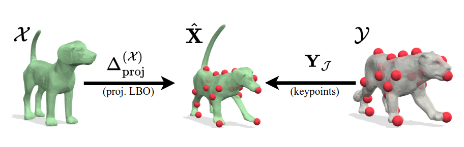

{{ page.authors }}

## Abstract

> We propose a novel mixed-integer programming (MIP) formulation for generating precise sparse correspondences for highly non-rigid shapes. To this end, we introduce a projected Laplace-Beltrami operator (PLBO) which combines intrinsic and extrinsic geometric information to measure the deformation quality induced by predicted correspondences. We integrate the PLBO, together with an orientation-aware regulariser, into a novel MIP formulation that can be solved to global optimality. In contrast to previous methods, our approach is provably invariant to rigid transformations and global scaling, intialisation-free, has optimality guarantees, and scales to high resolution meshes with (empirically observed) linear time. We show state-of-the-art results for sparse non-rigid matching on several challenging 3D datasets, including inconsistent meshing, as well as applications in mesh-to-point-cloud matching.

## Resources

<a href=" {{ page.paperurl }} ">[pdf]</a> <a href=" {{ page.arxiv }} ">[arxiv]</a> <a href=" {{ page.code }} ">[github]</a> <a href=" {{ page.video }} ">[video]</a> <a href=" {{ page.poster }} ">[video]</a>

## Bibtex

    @inproceedings{gao2023sigma,
        author 	= { Maolin Gao and Paul Roetzer and Marvin Eisenberger and Zorah L\"ahner and Michael Moeller and Daniel Cremers and Florian Bernard },
        title 	= { {SIGMA}: Quantum Scale-Invariant Global Sparse Shape Matching},
        booktitle = {International Conference on Computer Vision (ICCV)},
        year 	= 2023,
    }
