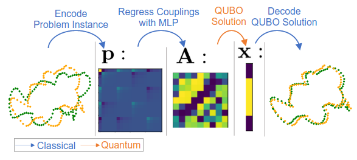

{{ page.authors }}

## Abstract

> Modern quantum annealers can find high-quality solutions to combinatorial optimisation objectives given as quadratic unconstrained binary optimisation (QUBO) problems. Unfortunately, obtaining suitable QUBO forms in computer vision remains challenging and currently requires problem-specific analytical derivations. Moreover, such explicit formulations impose tangible constraints on solution encodings. In stark contrast to prior work, this paper proposes to learn QUBO forms from data through gradient backpropagation instead of deriving them. As a result, the solution encodings can be chosen flexibly and compactly. Furthermore, our methodology is general and virtually independent of the specifics of the target problem type. We demonstrate the advantages of learnt QUBOs on the diverse problem types of graph matching, 2D point cloud alignment and 3D rotation estimation. Our results are competitive with the previous quantum state of the art while requiring much fewer logical and physical qubits, enabling our method to scale to larger problems. 

## Resources

<a href=" {{ page.paperurl }} ">[pdf]</a> <a href=" {{ page.arxiv }} ">[arxiv]</a> <a href=" {{ page.code }} ">[github]</a> <a href=" {{ page.video }} ">[video]</a> <a href=" {{ page.poster }} ">[video]</a>

The official project page is <a href="https://4dqv.mpi-inf.mpg.de/QuAnt/">here</a>.

## Bibtex

    @inproceedings{seelbach2022quant,
        author 	= {Marcel Seelbach Benkner and Maximilian Krahn and Edith Tretschk and Zorah L\"ahner and Michael Moeller and Vladislav Golyanik},
        title 	= { {QuAnt}: Quantum Annealing with Learnt Couplings},
        booktitle = {International Conference on Learning Representations (ICLR)},
        year 	= 2023,
    }
