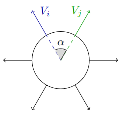

{{ page.authors }}

## Abstract

> Permutation matrices play a key role in matching and assignment problems across the fields, especially in computer vision and robotics. However, memory for explicitly representing permutation matrices grows quadratically with the size of the problem, prohibiting large problem instances. In this work, we propose to tackle the curse of dimensionality of large permutation matrices by approximating them using low-rank matrix factorization, followed by a nonlinearity. To this end, we rely on the Kissing number theory to infer the minimal rank required for representing a permutation matrix of a given size, which is significantly smaller than the problem size. This leads to a drastic reduction in computation and memory costs, e.g., up to 3 orders of magnitude less memory for a problem of size n = 20000, represented using 8.4 × 105 elements in two small matrices instead of using a single huge matrix with 4 × 108 elements. The proposed representation allows for accurate representations of large permutation matrices, which in turn enables handling large problems that would have been infeasible otherwise. We demonstrate the applicability and merits of the proposed approach through a series of experiments on a range of problems that involve predicting permutation matrices, from linear and quadratic assignment to shape matching problems.

## Resources

<a href=" {{ page.paperurl }} ">[pdf]</a> <a href=" {{ page.arxiv }} ">[arxiv]</a> <a href=" {{ page.code }} ">[github]</a> <a href=" {{ page.video }} ">[video]</a> <a href=" {{ page.poster }} ">[video]</a>

## Bibtex

    @inproceedings{droege2023kissing,
        author 	= {Hannah Dr\"oge and Zorah L\"ahner and Yuval Bahat and Onofre Martorell and Felix Heide and Michael Moeller},
        title 	= { Kissing to Find a Match: Efficient Low-Rank Permutation Representation },
        booktitle = {Neural Information Processing Systems (NeuRIPS)},
        year 	= 2023,
    }
