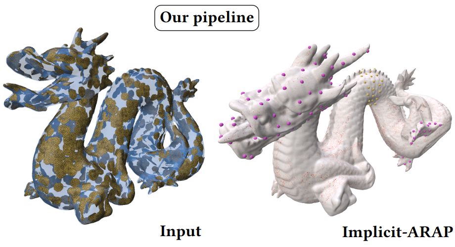

{{ page.authors }}

## Abstract

> In this work, we present the local patch mesh representation for neural signed distance fields. This technique allows to discretize local regions of the level sets of an input SDF by projecting and deforming flat patch meshes onto the level set surface, using exclusively the SDF information and its gradient. Our analysis reveals this method to be more accurate than the standard marching cubes algorithm for approximating the implicit surface. Then, we apply this representation in the setting of handle-guided deformation: we introduce two distinct pipelines, which make use of 3D neural fields to compute As-Rigid-As-Possible deformations of both high-resolution meshes and neural fields under a given set of constraints. We run a comprehensive evaluation of our method and various baselines for neural field and mesh deformation which show both pipelines achieve impressive efficiency and notable improvements in terms of quality of results and robustness. With our novel pipeline, we introduce a scalable approach to solve a well-established geometry processing problem on high-resolution meshes, and pave the way for extending other geometric tasks to the domain of implicit surfaces via local patch meshing.

## Resources

<a href=" {{ page.paperurl }} ">[pdf]</a> <a href=" {{ page.arxiv }} ">[arxiv]</a> <a href=" {{ page.code }} ">[github]</a> <a href=" {{ page.video }} ">[video]</a> <a href=" {{ page.poster }} ">[video]</a>

## Bibtex

    @inproceedings{baieri2024implicitarap,
        author 	= {Daniele Baieri and Filippo Maggioli and Zorah L\"ahner and Simone Melzi and Emanuele Rodolà},
        title 	= { Implicit-ARAP: Efficient Handle-Guided Deformation of High-Resolution Meshes and Neural Fields via Local Patch Meshing },
        booktitle = { arXiv:2405.12895 },
        year 	= 2024,
    }
