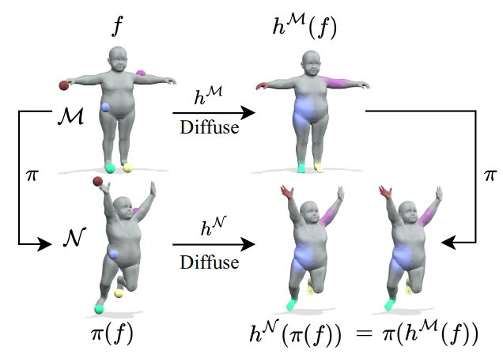

{{ page.authors }}

## Abstract

> Most recent unsupervised non-rigid 3D shape matching methods are based on the functional map framework due to its efficiency and superior performance. Nevertheless, respective methods struggle to obtain spatially smooth pointwise correspondences due to the lack of proper regularisation. In this work, inspired by the success of message passing on graphs, we propose a synchronous diffusion process which we use as regularisation to achieve smoothness in non-rigid 3D shape matching problems. The intuition of synchronous diffusion is that diffusing the same input function on two different shapes results in consistent outputs. Using different challenging datasets, we demonstrate that our novel regularisation can substantially improve the state-of-the-art in shape matching, especially in the presence of topological noise.

## Resources

<a href=" {{ page.paperurl }} ">[pdf]</a> <a href=" {{ page.arxiv }} ">[arxiv]</a> <a href=" {{ page.code }} ">[github]</a> <a href=" {{ page.video }} ">[video]</a> <a href=" {{ page.poster }} ">[video]</a>

## Bibtex

    @inproceedings{cao2024sync,
        author 	= { Dongliang Cao and Zorah Lähner and Florian Bernard},
        title 	= { Synchronous Diffusion for Unsupervised Smooth Non-Rigid 3D Shape Matching },
        booktitle = { European Conference on Computer Vision (ECCV) },
        year 	= 2024,
    }
