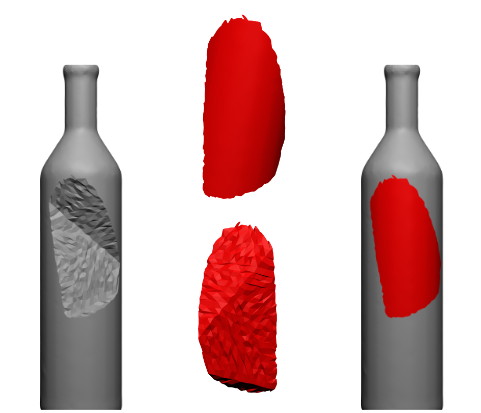

{{ page.authors }}

## Abstract

> This work addresses the problem of shape completion, i.e., the task of restoring incomplete shapes by predicting their missing parts. While previous works have often predicted the fractured and restored shape in one step, we approach the task by separately predicting the fractured and newly restored parts, but ensuring these predictions are interconnected. We use a decoder network motivated by related work on the prediction of signed distance functions (DeepSDF). In particular, our representation allows us to consider test-time-training, i.e., finetuning network parameters to match the given incomplete shape more accurately during inference. While previous works often have difficulties with artifacts around the fracture boundary, we demonstrate that our overfitting to the fractured parts leads to significant improvements in the restoration of eight different shape categories of the ShapeNet data set in terms of their chamfer distances.

## Resources

<a href=" {{ page.paperurl }} ">[pdf]</a> <a href=" {{ page.arxiv }} ">[arxiv]</a> <a href=" {{ page.code }} ">[github]</a> <a href=" {{ page.video }} ">[video]</a> <a href=" {{ page.poster }} ">[video]</a>

## Bibtex

    @inproceedings{schopf2024completion,
        author 	= {Michael Schopf-Kuester and Zorah L\"ahner and Michael Moeller},
        title 	= { 3D Shape Completion with Test-Time Training },
        booktitle = {ICLR Workshop on Geometry-Grounded Representation Learning and Generative Modeling (GRaM)},
        year 	= 2024,
    }
